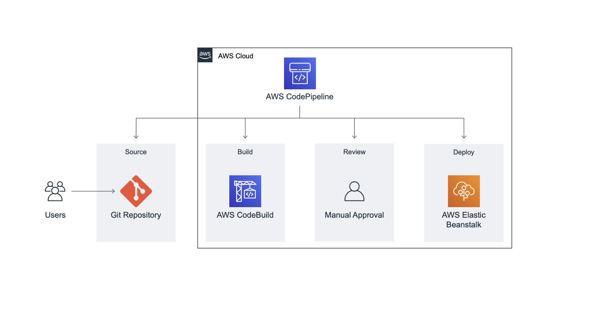
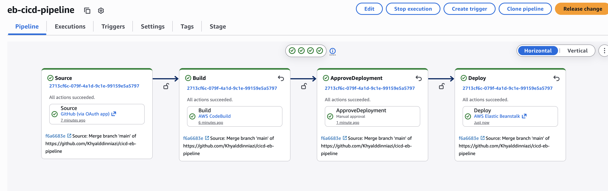
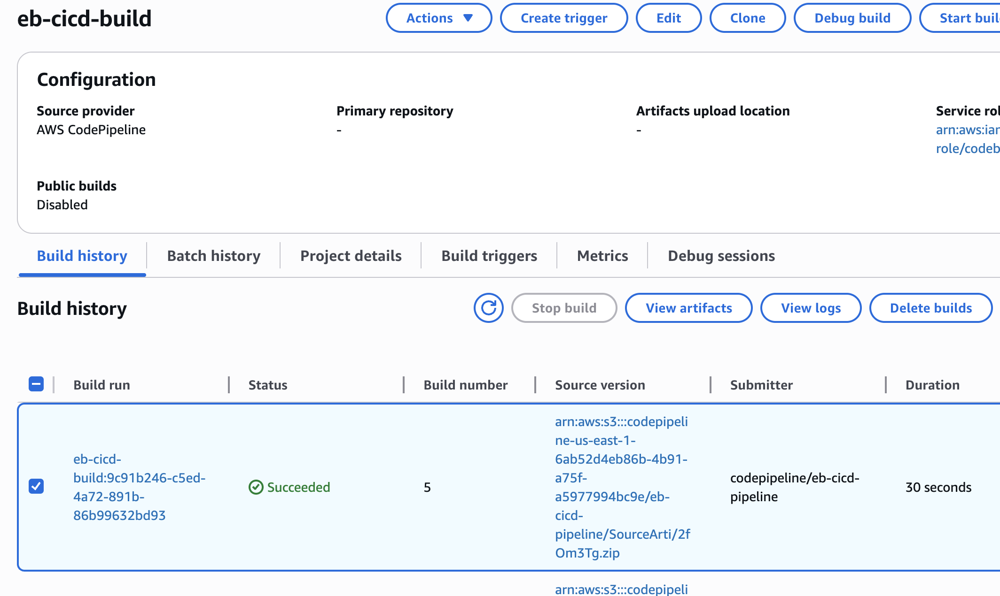
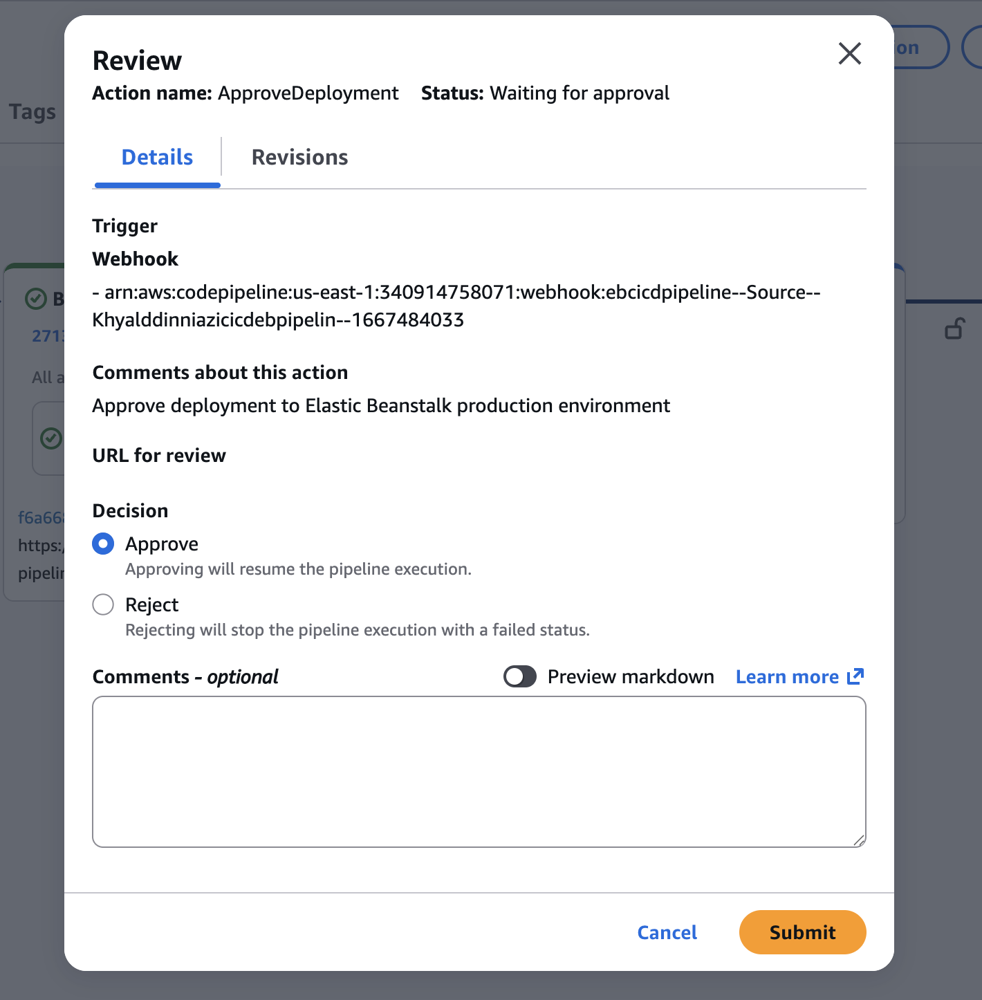
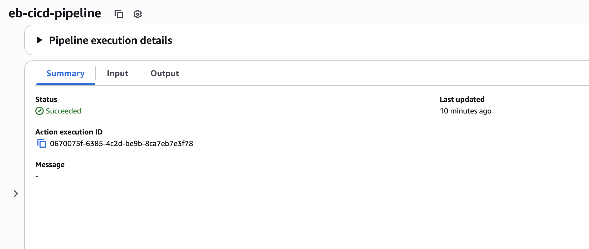
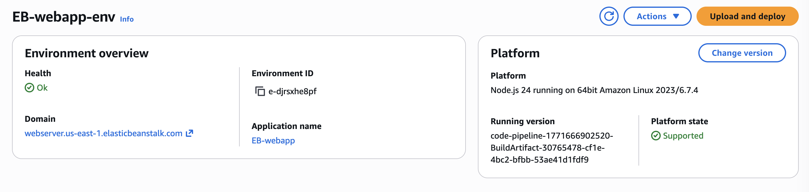
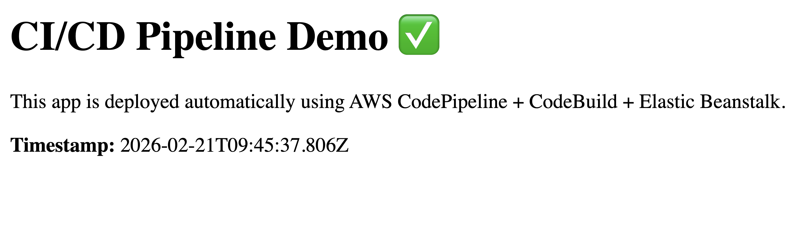

# CI/CD Pipeline to Elastic Beanstalk (CodePipeline + CodeBuild)

This project demonstrates a continuous delivery pipeline that automatically builds and deploys a simple Node.js web application whenever code is pushed to GitHub.

## Architecture

Users → GitHub → AWS CodePipeline → AWS CodeBuild → Manual Approval → AWS Elastic Beanstalk

### Flow Explanation

1. Developers push code to GitHub.
2. AWS CodePipeline automatically detects changes.
3. AWS CodeBuild installs dependencies and runs tests using buildspec.yml.
4. Manual approval gate ensures controlled production releases.
5. AWS Elastic Beanstalk deploys the new application version.

## AWS Services Used
- **AWS CodePipeline**: Orchestrates the CI/CD workflow
- **AWS CodeBuild**: Installs dependencies and runs tests using `buildspec.yml`
- **AWS Elastic Beanstalk**: Hosts the Node.js web application and performs deployments
- **Amazon S3**: Stores pipeline artifacts (managed by CodePipeline)
- **IAM**: Service roles for pipeline + build permissions

## How It Works
1. A commit is pushed to the `main` branch in GitHub
2. CodePipeline detects the change and triggers the pipeline
3. CodeBuild runs `npm ci` and `npm test`
4. (Optional) Manual approval gate requires confirmation
5. Elastic Beanstalk deploys the updated application version

## Screenshots

### Pipeline Overview

### CodeBuild Success

### Manual Approval Stage

### Deployment Success

### Elastic Beanstalk Environment

### Live Application

